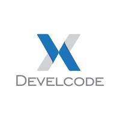

# Testes de conhecimento em tecnologia

> Repositório com informações para candidatos que queiram realizar os testes de conhecimentos em tecnologia

## Sobre a Develcode

A Develcode é uma empresa especializada no desenvolvimento de software, que procura sempre agregar valor e oferecer diferentes aplicações que atendam as necessidades do cliente. Você pode encontrar mais sobre nós em nosso [Linkedin](https://www.linkedin.com/company/develcode/mycompany/) ou nosso [site](https://www.develcode.com.br/)

## Tecnologias que utilizamos

<ul>
  <li style="margin-bottom: 20px">
    Backend
    

        
        
        
        
        
        
    

  </li>
  <li style="margin-bottom: 20px">
    Frontend
    

        
        
        
        
        
        
        
        

  </li>
  <li style="margin-bottom: 20px">
    DevOPS
    

        
        
        
    

  </li>
</ul>
